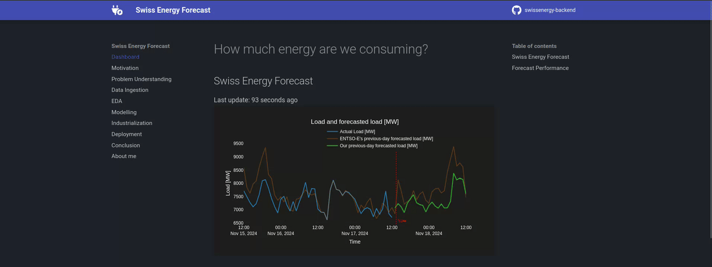

# Swiss Energy Forecast

 

🚀 <a href="https://swissenergyforecast.com"><strong>live dashboard & detailed write-up</strong></a> 🚀

 

This repository contains the ML backend & frontend powering an **energy consumption prediction dashboard**.

Inspired by the [SFOE's energy consumption dashboard](https://www.energiedashboard.admin.ch/strom/stromverbrauch), I figured it would be a great opportunity to talk about an end-to-end ML project, going over the challenges one encounters during

- Problem Understanding
- Data Ingestion
- Exploratory Data Analysis
- Machine Learning Modelling
- Industrialization
- Deployment

> [!IMPORTANT]
> I _heavily_ encourage you to check out the 🚀 [**write-up**](https://swissenergyforecast.com) 🚀 to make sense of this repo, as it goes through each stage methodically.

## Repo structure

`TODO`

## How to run locally

### Install

- Install `uv`
- Install the dependencies  `uv sync --project backend --dev` TODO
- Run `uv run pre-commit install` TODO

### Run

To run locally environment, run `docker compose up --watch --build`.

> [!NOTE]
> This will run both the frontend and backend.
> The backend will auto-reload/rebuild on any code changes (see `compose.override.yaml` for details)
> **FIXME**: The frontend will NOT auto-reload/rebuild on any code changes (see `compose.override.yaml` for details)

### Test

To run the tests, run `uv run pytest`.

## How to deploy

Both backend & frontend are running on a VPS.
The deployment is triggered by a push to `main` via GitHub Actions.